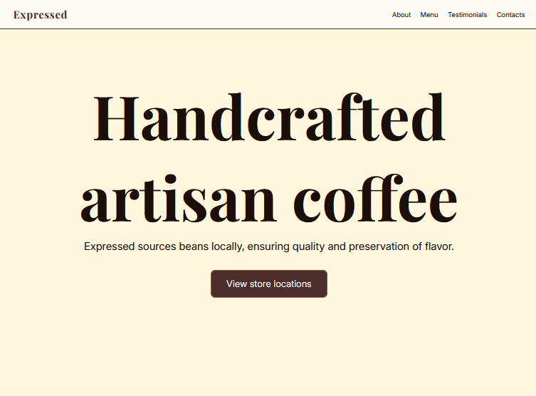

# expressed-landing-page

A stylized landing page for a
test coffee store

## Live Demo

[vClaudio11.github.io/expressed-landing-page](https://vClaudio11.github.io/expressed-landing-page)

## Screenshot



## Built With

- HTML5
- CSS3 — Flexbox, custom properties, display grid, media queries, clamp()
- JavaScript — active states toggle

## Features

- Sticky navigation bar
- Toggled hamburger button 
- Responsive layout across mobile, tablet and desktop breakpoints

## Getting Started

No installation needed. To run locally:

1. Clone the repository
```bash
git clone https://github.com/vClaudio11/express-landing-page.git
```
2. Open `index.html` in your browser

## Roadmap

- [ ] update color palette
- [ ] add images to hero, menu and contacts section
- [ ] add new page links to footer
- [ ] add customer testimonials 

## License

This project is open source and available under the 
[MIT License](LICENSE).